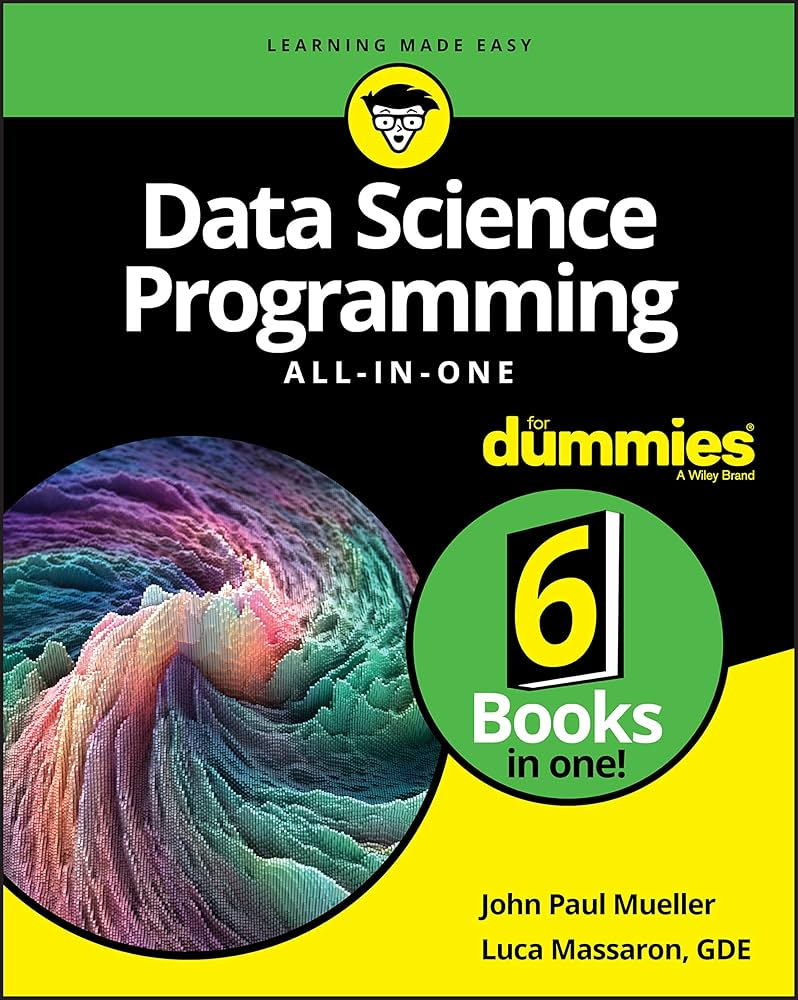
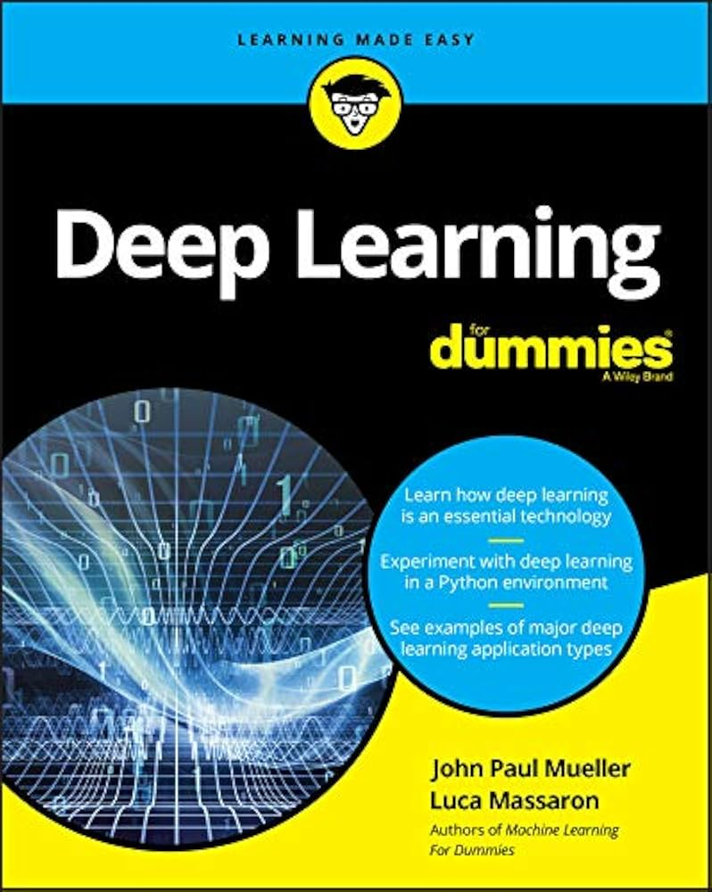
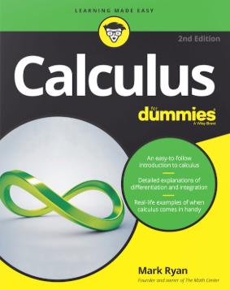

## الأقسام

تتكون الخارطة من 4 أقسام رئيسية :

- تحليل البيانات
- البرمجة وعلوم الحاسب
- الذكاء الاصطناعي
- الرياضيات

### تحليل البيانات

تحليل البيانات عملية مهمة تحتوي على تنظيف البيانات وانتقائها وتصويرها وحتى نمذجتها وتجهيزها وإستنتاج النتائج منها .

تحليل البيانات جزء أساسي من مجال علم البيانات بالإضافة لتعلم الآلة وتعلم الآلة يعد حجر الأساس لمجال الذكاء الاصطناعي وكذلك بعض تطبيقات الرياضيات كالاحصاء وبحوث العمليات .

تعد مفاهيم البيانات والمواضيع الإدارية في المدونة تحت هذا القسم كما هو موضح في الخارطة

### البرمجة وعلوم الحاسب

علوم الحاسب هو التخصص الأم لمجال التقنية , ويضم كلاً من الخوارزميات , هندسة البرمجيات , النظم الموزعة , أساسيات البرمجة وحتى الذكاء الاصطناعي والأمن السيبراني .

كما أن البرمجة مجال مهم من مجالات علوم الحاسب وهي كتابة أوامر وتعليمات بلغات برمجة عالية المستوى شبيهة بلغة البشر يتم تحويلها للغة التجميع التي يتم تحويلها من المجمع بدورها إلى لغة الآلة أو لغة الصفر والواحد الثنائية وهي اللغة الوحيدة التي يفهمها الحاسوب .

أغلب مقالات المدونة تعد تحت هذا القسم ومن ضمنها بعض مواضيع الذكاء الاصطناعي كتعلم الآلة والمكتبات البرمجية .

### الذكاء الاصطناعي

الذكاء الاصطناعي هو مجال يُدرس إمكانية صنع أنظمة تحاكي البشر وعقليتهم , يعد من المجالات الواسعة التي تجمع بين علوم الحاسب والرياضيات لكنه يندرج تحت علوم الحاسب بشكل عام

كثير من مقالات المدونة تحت هذا القسم , وتقريباً هو القسم الأساسي في المدونة

### الرياضيات

الرياضيات من أشهر العلوم الطبيعية وأكثرها فائدة ومرتبة من بين بقية العلوم , بل أنها تعد بمثابة العلم الأم لبعض العلوم كالفيزياء والكيمياء .

كما أن الرياضيات مرتبطة إرتباطاً وثيقاً بعلوم الحاسب والعديد من مجالاته كالخوارزميات وتحليل البيانات ولاسيما الذكاء الاصطناعي .

الرياضيات بشقيها البحتة والتطبيقية تعد شرطاً أساسياً تقريباً لتعلم الذكاء الاصطناعي والتقدم فيه بشكل مستمر .

---

## المصادر

تم الإعتماد في المدونة على العديد من الموسوعات والمصادر الموثوقة والكتب الأكاديمية والدراسات والبحوث

أبرز ما أعتمدت عليه هو كتب سلسلة :

`For Dummies`

تحديداً :

- Data Science Programming for Dummies , By John Mueller and Luca Massaron :

يعد كتاب برمجة علم البيانات من أفضل الكتب في المجال , ويشمل الأساسيات وتحليل البيانات وتعلم الآلة ومجالات شتى كالرؤية الحاسوبية والتعلم العميق ومعالجة الصور

- Deep Learning for Dummies , By John Mueller and Luca Massaron :

من نفس مؤلفي الكتاب السابق لكنه يركز بشكل كبير على التعلم العميق والشبكات العصبية .

- Calculus for Dummies , By Mark Ryan :

ويعد من أفضل الكتب لدي عن مجال التفاضل والتكامل وأساسياته وتطبيقاته والذي فادني جامعياً وتقنياً .

وبغض النظر عن سلسلة الكتب هذه أعتمدت على كتب أخرى من :

- Pearson

- McGraw Hill

ودور نشر أخرى

ومن المواقع الإلكترونية التي أعتمدت عليها بالإستمرار :

- W3Schools

- Geeksforgeeks

- Wikipedia

- Khan Academy

بالإضافة لدورات موجودة في :

- Udacity

- Coursera

- Udemy

ومقالات من شركات موثوقة مثل :

- IBM

- Google

- Microsoft

- Oracle

- Meta

---
والله ولي التوفيق ...
