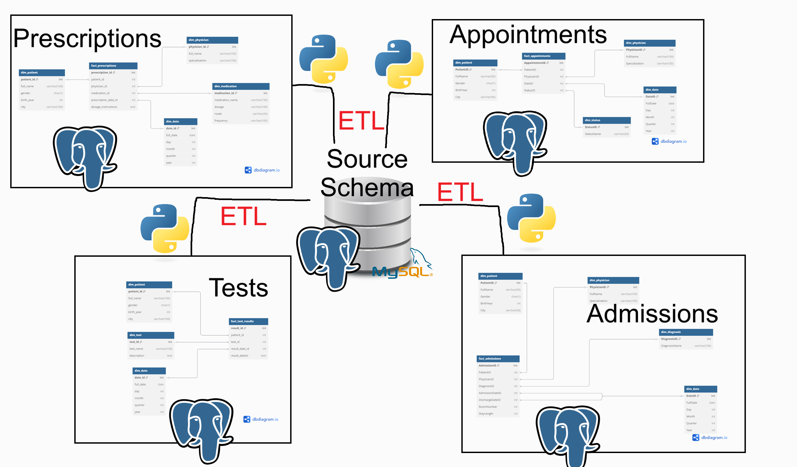
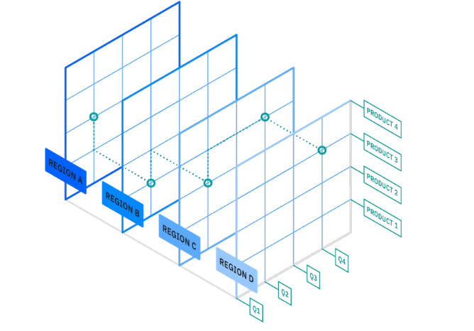

# مقدمة
مستودع البيانات هو نظام لإدارة البيانات بشكل متقدم يختلف عن قواعد البيانات التقليدية

[لمراجعة قواعد البيانات](https://saadaiblog.netlify.app/blog/post26)

### مستودعات البيانات ضد قواعد البيانات

قواعد البيانات أو ماتعرف بالـ :

`OLTP`

هي قواعد بيانات غالباً تكون علائقية أي بإستخدام لغة الاس كيو إل ومصممة لتسجيل وسحب العمليات اليومية مثل قواعد بيانات متاجر السوبرماركت , أندية الجيم , وحتى المطارات .

بينما تركز مستودعات البيانات أو ماتعرف بالـ :

`OLAP`

على تحليل وأخذ كمية هائلة من البيانات الفائقة والكبيرة والتي تعرف عادة بمصطلح الـ :

**Big Data**

وتستخدم هذه المستودعات بشكل رئيسي في عمليات إتخاذ القرار ومجال ذكاء الأعمال المشتق من مجال تحليل البيانات .

ظهر المفهوم في ثمانينيات القرن الماضي وسرعان ماتم زيادة الطلب عليه خصوصاً بعد نشأة شبكة الويب ووسائل التواصل الاجتماعي وأنظمة الدفع الذكية .

### كيف تتكون مستودعات البيانات ؟

تتكون من ثلاثة طبقات رئيسية لتحويل البيانات لغرض تحليلها :

- طبقة سفلى :

ومنها تتدفق البيانات من أنظمة مصادر متعددة للخادم حيث يتم تخزينها بشكل تقليدي عبر عملية :

`ETL - Extract , Transfer , Loading`

وفيها تُستخرج وتُحول وتتخزن البيانات

ونظراً لأن مستودعات البيانات تخزن البيانات المنظمة عادةً فإن هناك طريقة أخرى اسمها :

`ELT - Extract , Loading , Transfer`

وفيها يتم تحويل البيانات بعد تخزينها , وهذه يتم استخدامها في بحيرات البيانات , وبحيرات البيانات هي مستودع بيانات يُخزن فيه عدد كبير من البيانات غير المنظمة .

- طبقة وسطى :

تحتوي هذه الطبقة أنظمة محرك تحليلات للبيانات الموجودة فيها

- طبقة عليا

### مشتقات مستودعات البيانات

- مستودعات البيانات التقليدية :

والتي يتم بنائها بلغة علائقية مثل الاس كيو ال للإستعلامات أو حتى بناء قاعدة البيانات نفسها

- مستودعات البيانات السحابية :

مع تزايد الطلب ونشأة مجال الحوسبة السحابية , تم إنشاء مستودعات البيانات السحابية التي تعتمد بشكل كبير على السحابة وهو مفهوم جديد نسبياً ويعني حفظ البيانات عبر الإنترنت بدلاً من تخزينها على ذاكرة الجهاز

هذه قللت العديد من التكاليف حول صيانة الأجهزة وشراء الأجهزة المطلوبة , لكنها خلقت العديد من المشاكل والثغرات الأمنية .

- بحيرات البيانات :

وهي مستودعات بيانات مرنة تخزن البيانات بشكل خام وتركز على البيانات غير المنظمة أو المهيكلة مثل الصور والفيديوهات وغالباً يتم بنائها بأنظمة غير علائقية مثل :

`JSON`

#### أبرز الشركات الرائدة في مجال مستودعات البيانات

- IBM

- Google

- Microsoft

- Oracle

- Amazon

- Snowflake

- Databricks

## مصادر ومراجع :

- [IBM - ماهي مستودعات البيانات ؟](https://www.ibm.com/sa-ar/think/topics/data-warehouse)
- [Oracle - ماهي مستودعات البيانات ؟](https://www.oracle.com/sa-ar/database/what-is-a-data-warehouse/)
- [SAP - مستودع البيانات , المفهوم والتكوين والبنية](https://www.sap.com/mena-ar/products/data-cloud/datasphere/what-is-a-data-warehouse.html)
- SQL - For Dummies