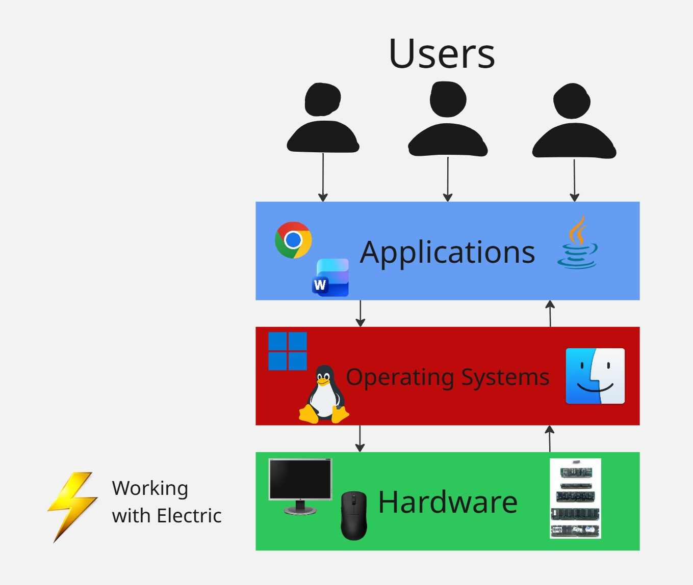
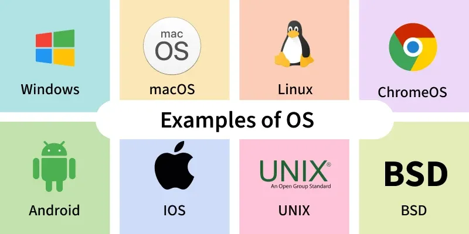
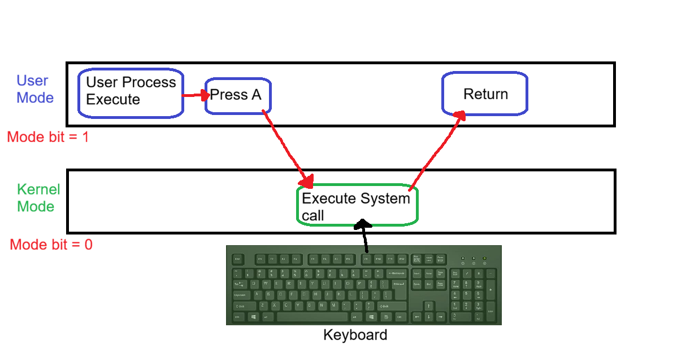
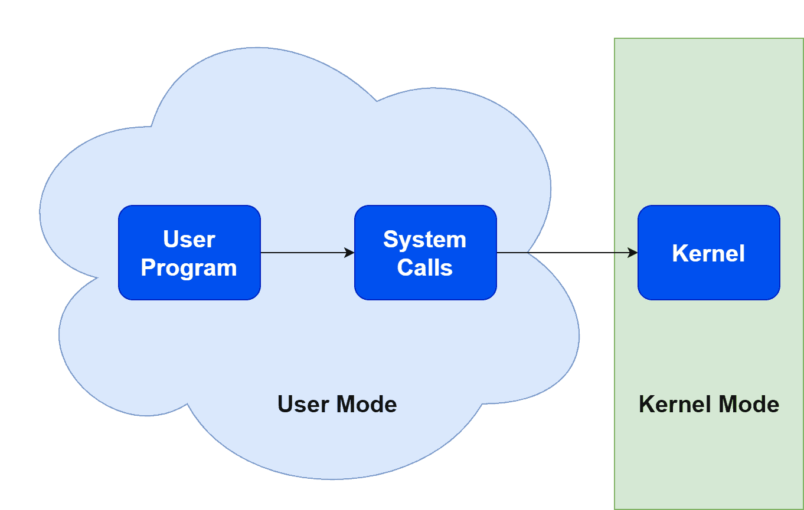
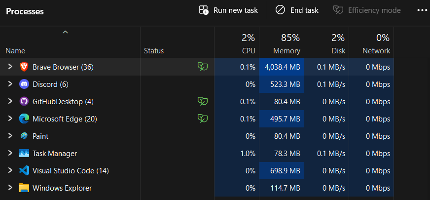
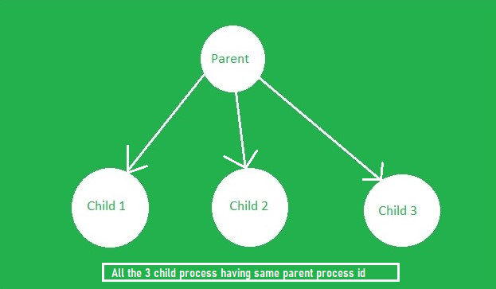
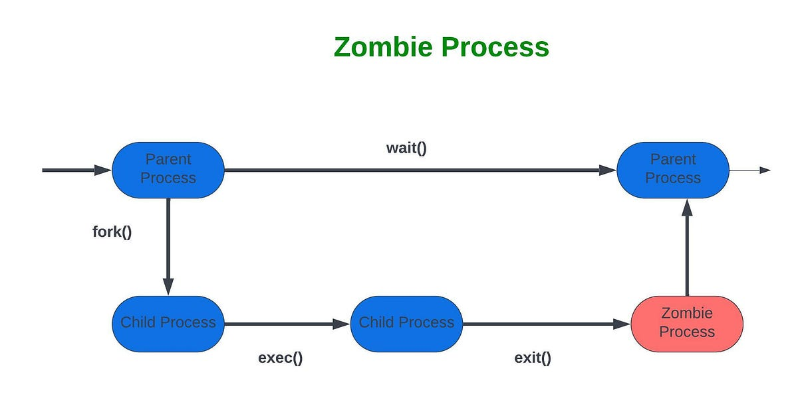
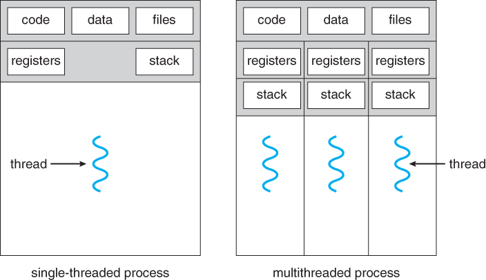
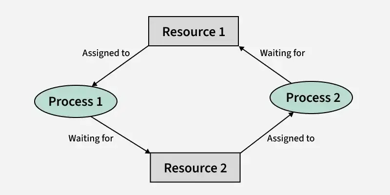

نظام التشغيل هو برنامج وسيط بين عتاد الجهاز ومستخدم الجهاز بالكمبيوتر , بدون نظام التشغيل فأن جهاز الكمبيوتر بلا فائدة .

في الصورة أعلى نلاحظ كيف يتعامل المستخدم مع البرمجيات مثل المتصفحات , محررات الأكواد , محررات النصوص , وحتى بيئات لغات البرمجة وبرمجيات الصور وتنقسم البرمجيات لنوعين أساسيين :

- تطبيقات النظام/System Programs :

وهي البرمجيات التي تأتي مع نظام التشغيل كالبرمجيات الثابتة أو البرامج المدعومة رسمياً من الشركة مثل مايكروسوفت إيدج في ويندوز

- تطبيقات المستخدم / User Programs :

وهي البرمجيات التي يقوم المستخدم بتحميلها وحذفها على هواه ورغبته الشخصية , وحتى تلك التي قام ببرمجتها الشركات الضخمة تعد من هذا النوع كونك تقوم بتنزيلها بشكل يدوي

ونلاحظ أن البرامج تتعامل مع نظام التشغيل وهو برنامج متقدم يقوم بالتعامل مع عتاد الجهاز وهو الأجهزة الكهربائية التي تقوم بتشغيل الجهاز والتحكم به

بينما عتاد الجهاز آخر شيء مثل المعالج والذاكرة الأساسية وحتى أجهزة الإدخال والإخراج مثل الشاشة والكيبورد والماوس وحتى الطابعة وغيرها تعد أجهزة غبية غير قادرة على إدارة نفسها بنفسها وحتى البشر لايقدرون على التعامل معها بشكل مباشر فوجب إستخدام أنظمة التشغيل للتعامل معها بشكل رئيسي

### أبرز أنظمة التشغيل

- مايكروسوفت ويندوز :

النظام التشغيل الأشهر والأوسع والأكثر إستخداماً في المجال من تطوير عملاقة الصناعة مايكروسوفت , من منتصف الثمانينات حتى الآن أصدرت لنا ويندوز ما يقارب العشرون نظام تشغيل من ويندوز 1.0 مروراً بنسخ التسعينات مثل ويندوز 95 و 98 وكذلك ويندوز إكس بي مع نسخ أيقونية كويندوز 7 وصولاً لنسخ حديثة مثل ويندوز 10 و 11

مع إخفاقات نسبية في بعض أنظمة التشغيل مثل ويندوز فيستا وويندوز 8 .

- لينكس :

وهي نواة نظام تشغيل مفتوحة المصدر قام بانشائها طالب فنلندي يدعى لينوس تورفالدس عام 1991 لنظام تشغيل جنو , ومنذ ذلك الحين تم إستخدامها في بناء مئات وآلاف التوزيعات الشهيرة مثل ديبيان , أوبنتو , ريد هات , كالي لينكس , باروت أو إس , آرتش لينكس وغيرها الكثير...

وحتى أنه من ضمن هذه التوزيعات أصبحت تجارية وقائمة عليها شركات مثل أوبنتو وريد هات وكالي لينكس.

[مقالة لينكس](post26.5.qmd)

- ماك آو إس :

وهو نظام تشغيل من شركة آبل لأجهزة كمبيوتر ماكنتوش , ويعتبر المنافس الرئيسي لويندوز لفترة طويلة .

- آندرويد :

نظام تشغيل مفتوح المصدر صممته شركة جوجل يجمع بين نواة لينكس وحزم لغة جافا , ويعمل بشكل رئيسي في أغلب أجهزة الهواتف الذكية .

- آي أو إس :

وهو نظام تشغيل من شركة آبل مبني على نظامها السابق ماك أو إس ويدعم هواتف الآيفون وجهاز الآيباد اللوحي بشكل رئيسي حصراً دون غيرها .

### مهام نظام التشغيل الأساسية

1. واجهات المستخدم :

واجهات رسومية - واجهات سطر الأوامر - واجهة لمس الشاشة

2. تنفيذ البرامج

3. عمليات الإدخال والإخراج

4. أنظمة إدارة الملفات

5. التواصل

6. إكتشاف الأخطاء

7. تحديد عتاد الجهاز لعمليات معينة

8. الحسابات

9. الخصوصية والحماية

### كيف يعمل نظام التشغيل ؟

يعد نظام التشغيل برنامج مسؤول عن التواصل بين البرمجيات وعتاد الجهاز , وهناك برنامج داخل نظام التشغيل يتم تشغيله منذ بداية تشغيل الجهاز حتى نهايته يُدعى النواة أو :

`Kernel`

مسؤول عن كل العمليات الرئيسية لكن قبل هذا كله فإنه هناك برمجية ثابتة غالباً تضعها الشركة المصنعة في الجهاز وتسمى الـ :

`Bootstrap loader or Bootloader`

وهو أول برنامج يعمل عند التشغيل ويظهر شعار الشركة المصنعة ويقوم هو بتشغيل الكيرنل أو النواة ومع النواة يعمل نظام التشغيل كاملاً

يتم إدارة نظام التشغيل بشكل رئيسي عبر المُقاطعة أو الـ :

`Interrupt`

والمقاطعة هي إشارة كهربائية تنقل التحكم إلى خدمة معينة

وهناك نوعين من المقاطعات :

- Hardware Interrupts / مقاطعات الأجهزة الكهربائية :

وهي إشارة من جهاز خارجي للمعالج لإعلامه بحدث يتطلب تدخل المعالج بشكل فوري

- Software Interrupts / مقاطعات برمجية :

وقد تكون خطأ/إيرور أو حلقة لا نهائية أو برامج تقوم بتعديلات في بعضها البعض أو حتى برامج تعدل نظام التشغيل نفسه .

وطبعاً عندما تضغط على زر في الكيبورد ويظهر على الشاشة فأنه يحدث مقاطعة كهربائية تأخذ الاستجابة من نظام التشغيل للكيبورد ثم مرة أخرى للشاشة لكي يعرض الحرف الذي أنت قمت بالضغط عليه , وهذا كله في أجزاء من الثانية .

#### تبديل الأدوار

هناك وضعين رئيسيان في نظام التشغيل وهي :

- User mode / وضع المستخدم

- Kernel mode / وضع النواة

هناك شيء يحدد الوضعية الحالية المستخدمة في نظام التشغيل يدعى ال :

`Mode Bit`

إن كان يساوي 1 فإن الوضعية هي وضع المستخدم وإن كان 0 فهي وضع النواة

نلاحظ هنا كيف تم إستدعاء النظام والنقل من وضع المستخدم للنواة بمجرد أن ضغط المستخدم زر في الكيبورد :

#### إستدعاء النظام

إستدعاء النظام أو الـ :

`System Calls`

واجهة برمجية يوفرها نظام التشغيل لطلب خدمة من خدمات النظام , وغالباً تكون مبنية بلغات مثل سي وسي بلس بلس لكفاءتها العالية .

لكي تستخدم البرامج إستدعاءات النظام فهي تستخدم شيئا آخر يُعرف بواجهة برمجة التطبيقات أو :

`API - Application Programming Interface`

##### : أبرز واجهات برمجة التطبيقات

- WIN32 API :

يستخدم في ويندوز

- POSIX API :

يستخدم في لينكس ويونكس وماك آو إس

- JAVA API :

يستخدم في آلة جافا الافتراضية وهي طبقة وسيطة لتشغيل برمجيات لغة جافا على الأجهزة بكفاءة عالية ومتقاربة من جهاز لجهاز .

#### البرامج والعمليات

البرنامج هو كائن خامل , يعني بمجرد تشغيله تعمل تحته الكثير من العمليات

بينما العمليات كائنات نشطة حيث تؤدي كل منهم أدوار معينة في البرنامج

قد يكون للبرنامج أكثر من عملية وكذلك قد تكون العملية متشاركة بين أكثر من برنامج , وتسمى البرامج متعددة العمليات :

`Multi-processes`

وأغلب البرامج في يومنا الحالي من هذا النوع , أبرزها جوجل كروم وغالباً هذه البرامج تستنزف طاقة الجهاز وتأخذ حيز كبير من قدرة الجهاز وعتاده مثل الذاكرة وقوة المعالج

نلاحظ أسفل في مدير المهام في ويندوز , قسم العمليات حيث هناك برامج تعمل مثل متصفح بريف وديسكورد :

ونلاحظ أنه أسفل برنامج متصفح بريف 36 عملية !!! وتستنزف 4 قيقا بايت من طاقة الرام وهو مايعد شيئا جنونياً في عصرنا الحالي

مما أدت الحاجة لشيء آخر وهي :

**Threads - الخيوط**

المسؤول الرئيسي عن تنفيذ العمليات هو المعالج أو وحدة المعالجة المركزية مما أدت الحاجة لإختراع أشياء مثل :

- DMA :

تقنية تتيح نقل البيانات من جهاز تخزين لآخر بدون الحاجة للمعالج إلا فقط في بداية ونهاية العملية , على عكس السابق حيث كان المعالج مسؤولاً عن نقل البيانات جزء بجزء مما يسبب بطئ قوي في الجهاز .

- CPU Scheduling / جدولة المهام بالمعالج :

وهي جعل المعالج يقوم بتنفيذ مهام قبل مهام أخرى وإيقاف مهام لتنفيذ مهام ذات أولوية أكثر , مما يسبب بتسريع العمليات على الجهاز وتحسين الكفاءة .

وتتم هذه التقنية عبر خوارزميات حديثة مثل :

- RR (Round Robin)

- SJF

- FCFS

وتعد هناك حالات للعمليات مثل :

- New :

حيث أنه هناك عملية جديدة تم انشائها

- Ready :

العملية جاهزة للعمل

- Running :

العملية يتم تنفيذها

- Waiting :

العملية في قيد الإنتظار

- Terminated :

العملية تم إنهائها

ويمكن للعملية أن تنتج عمليات تابعة لها تسمى :

`Child Process - عملية طفلة`

وتسمى بالنسبة لها العملية التي قامت بانشائها عملية أبوية أو :

`Parent Process - عملية أبوية`

العملية الطفلة التي تم إكمالها بينما العملية الأبوية لم تهتم بقراءة حالتها وإنهائها , تسمى عملية زومبي أو :

`Zombie Process`

#### الخيوط

وهي عمليات خفيفة الحجم , تشارك الذاكرة على عكس العمليات التي تعزل ذاكرتها الخاصة وكذلك سريعة الإنشاء والتبديل بينها ورخيصة الثمن مقارنة بالعمليات ولديها كفاءة عالية في الاتصالات .

الخيوط مثل العمليات قد تستهلك كميات كبيرة من الرام ولديها مشاكل أمنية أكثر من العمليات كونها تشارك الذاكرة بل ولديها مشاكل في التزامن , أي بمعنى حدوث توقف تام بسبب أنه هناك أكثر من خيوط يحاولون العمل في نفس الوقت في نفس الجزئية .

## مصادر ومراجع :

-[Geeksforgeeks - Operating Systems](https://www.geeksforgeeks.org/operating-systems/operating-systems/)
- Operating System Concepts - Silberschatz, Galvin, Gagne (Dinosaurs book)
-[IBM - What is an Operating Systems ?](https://www.ibm.com/think/topics/operating-systems)
-[Tutorialspoint - Operating Systems tutorial](https://www.tutorialspoint.com/operating_system/index.htm)
- Pearson Operating Systems: Internals and Design Principles book
-[Google on coursera - Operating Systems and You: Becoming a Power User](https://www.coursera.org/learn/os-power-user)