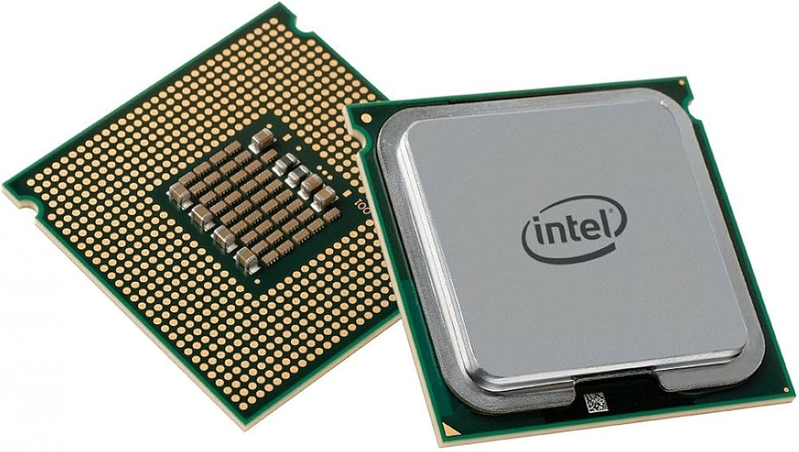
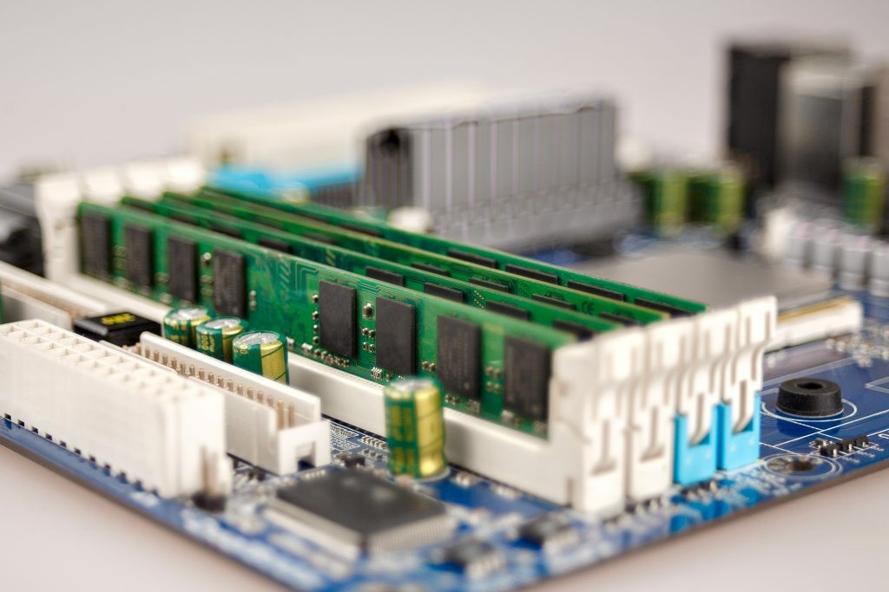
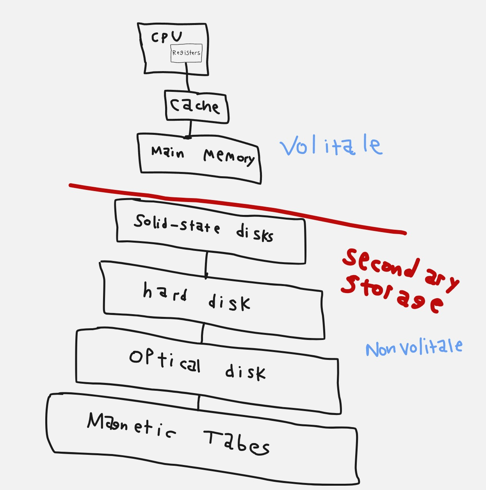
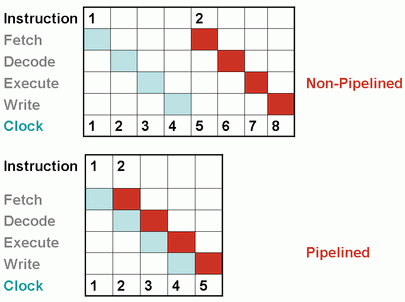
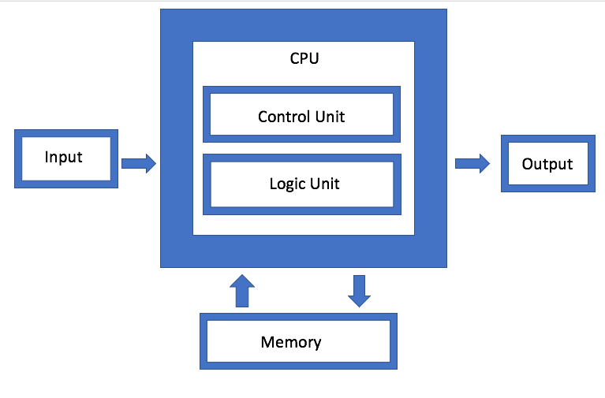
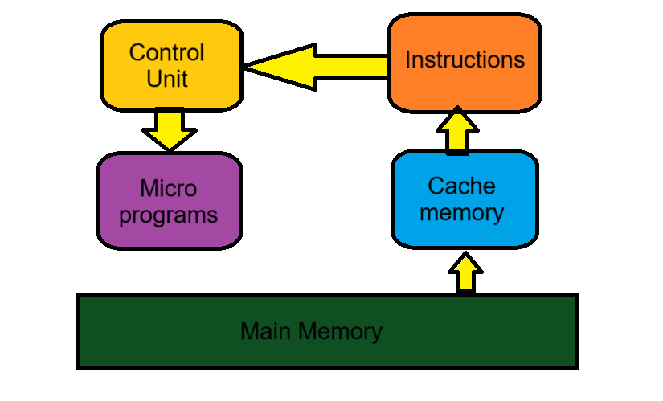
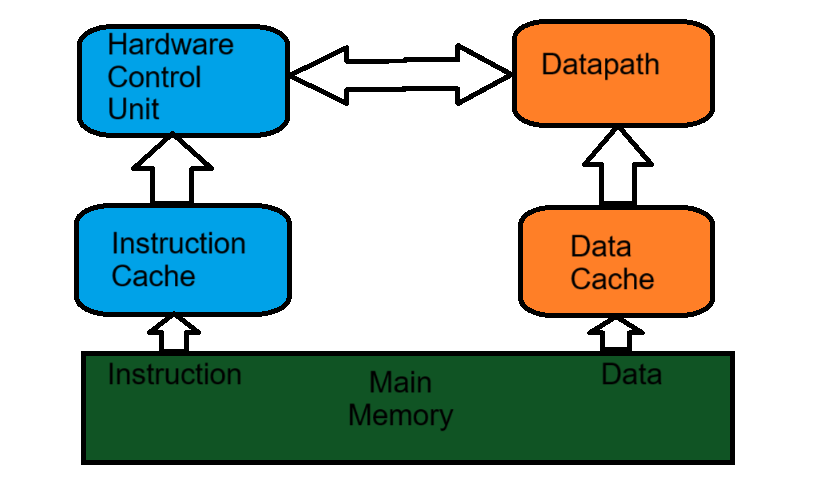

هي البنية الرئيسية التي تصف مما يتكون جهاز الكمبيوتر وكيف يتصرف مع كل جزء ووظيفة كل جزء .

## المكونات الرئيسية

- المعالج :

أو وحدة المعالجة المركزية , وهو وحدة كهربائية في اللوحة الأم لجهاز الحاسوب تعد العقل الرئيسي والوحدة الأم , بدونها الحاسوب بلا أي فائدة ولا حتى يمكن تشغيله .

قد يكون المعالج أحادي النواة , أي أنه لايمكنه إلا أداء مهمة واحدة في ذات الوقت وهو شيء غير عملي في وقتنا الحالي مما يجعل أغلب معالجات العصر الحالي متعددة الأنوية

كما تشتهر شركتين رئيسيتان في صناعة المعالج وهما : إنتل وإي ام دي



في المعالج 3 وحدات رئيسية وهي :

1. ALU (Arithmetic Logic Unit) :

وهي وحدة الحساب والمنطق الرئيسية , المسؤولة عن الحسابات كإجراء العمليات الحسابية الأساسية والعمليات المنطقية

2. Registers :

أو السجلات , وهي وحدات تخزينية موجودة في المعالج لكنها لا تكفي لإستخدام كل شيء , وتعد سريعة الأداء أكثر من الذاكرة المؤقتة والذاكرة الرئيسية

3. Control Unit (CU) :

وهي وحدة التحكم في المعالج , وهي العقل المدبر داخل المعالج تسمح بتوجيه البيانات والسماح لها وتقوم بجلب البيانات في خطوات شهيرة :

- FETCH / جلب البيانات

- DECODE / فك تشفيرها

- EXECUTE / تنفيذها


<hr>

- الذاكرة الرئيسية :

أو ماتعرف بالرام أو ذاكرة الوصول العشوائي , وهي الذاكرة التي يتعامل معها المعالج بشكل مباشر.

بمجرد إقفال الجهاز يتم مسح البيانات المسجلة عليها بشكل مباشر , وفي زمننا الحالي مساحة الذاكرة الرئيسية بين 8 جيجا بايت و 16 جيجا بايت في أغلب الحواسيب وقد تصل بعضها ل32 جيجا بايت .




خبر حديث نسبياً للرامات :
**زادت أسعار الرامات في العام الماضي نتيجة للطلب المتزايد عليها لتدريب نماذج الذكاء الاصطناعي**

<hr>


- ذاكرة القراءة فقط :

ذاكرة دائمة غير قابلة للتعديل , يتم تخزين فيها البرمجيات الثابتة وتحتفظ بالبيانات حتى بعد إغلاق الجهاز

<hr>

- وحدة التخزين :

هي نوع من وحدات التخزين ذات مساحات شاسعة مقارنة بالذاكرة الرئيسية والذاكرة المؤقتة والسجلات وتكون غالباً منفصلة عن الجهاز أو مدمجة فيه في اللوحة الأم , تستخدم لتخزين البرامج الكبيرة وألعاب الفيديو في المساحات الشاسعة .

وغالباً ما تكون 1 تيرابايت في زمننا الحالي .

<hr>

- الذاكرة المؤقتة :

أو الكاش , هي ذاكرة صغيرة فائقة السرعة تستخدم لجلب البيانات الإعتيادية وتعتبر جسر رئيسي بين المعالج والذاكرة الرئيسية




<hr>

- أجهزة الإدخال والإخراج :

ويُقصد بها كل الأجهزة المسؤولة عن إدخال البيانات وإخراجها

مثل الكيبورد , الماوس , الشاشة , الطابعة وغيرها الكثير....

### البرمجة في مجال معمارية الحاسب


#### لغة التجميع

أو الأسيمبلي , هي لغة برمجة منخفضة المستوى وتعد التعبير البشري الأقرب للغة الآلة .

يتم ترجمتها للغة الآلة عبر برنامج اسمه المُجمع أو :

`Assembler`

دون الحاجة لمترجمات لغات البرمجة التقليدية .

| مستوى اللغة | الوصف / الأمثلة |
|------------------------|------------------------------------------------------|
| **اللغة عالية المستوى** | أمثلة: C / C++ / Java / Python / Fortran |
| **المُترجِم (Compiler)** | يُترجم من اللغة عالية المستوى إلى لغة التجميع |
| **لغة التجميع (Assembly)** | كود رمزي |
| **المُجمِّع (Assembler)** | يُترجم من لغة التجميع إلى لغة الآلة |
| **لغة الآلة** | كود ثنائي، أو كود ثُماني أو سداسي عشري |

### البرنامج

البرمجة هي كتابة أوامر لينفذها للحاسوب , لكن جهاز الحاسوب لا يفهم سوى لغة الآلة (الصفر والواحد)

فأي أوامر تكتبها بلغة برمجة عالية مستوى مثل جافا , سي بلس بلس , بايثون وحتى رست سيتم ترجمته للغة تجميع ومن ثم إلى لغة الآلة

​```cpp
#include <iostream>
using namespace std;
int main() {
    cout << "Hello, world!" << endl;
    
    return 0;
}
​```

هذا الكود سيتم تحويله إلى لغة التجميع بواسطة المجمع

### Pipelining - خط الأنابيب

وهو نموذج يسرع عملية جلب البيانات وفك تشفيرها وتنفيذها وكتابتها , وهدف العملية هذه هو تسريع الوقت وإستغلال الوقت غير المستخدم



فلا ننتظر بعد جلب البيانات أن نفك تشفيرها بينما خانة جلب البيانات خالية , نستغل الوقت ونقوم بتقليص المهام للإنجاز في أسرع وقت .

### أنواع المعماريات

#### معمارية فون نيومان

وهي المعمارية المستخدمة حالياً في أغلب الأجهزة وتأثرت بها أغلب لغات البرمجة , تم تقديمها من قِبل عالم الرياضيات الأمريكي جون فون نيومان عام 1945 م .

تتكون بشكل رئيسي من :

- المعالج

- الذاكرة الرئيسية

- وحدات الإدخال والإخراج



#### معمارية هارفارد

تقوم هذه المعمارية بالفصل بين تخزين البيانات والتعليمات , وتستخدم مسارات إشارات منفصلة لكل منهما

ومن خلال هذا الفصل يسمح للمعالج بالقراءة والجلب للبيانات بنفس الوقت .

تعد هذه المعمارية مستخدمة في النظم المدمجة والمعالجات الرقمية .

### أنواع معماريات التعليمات

- CISC (Complex Instruction Set Computing) : 

تنفذ أوامر متعددة ومعقدة في تعليمة واحدة



- RISC (Reduced Instruction Set Computing) :

تنفذ أوامر بسيطة ذات سرعة عالية جداً




## مصادر ومراجع

- [Wikipedia - Computer Architecture](https://en.wikipedia.org/wiki/Computer_architecture)
- [Geeksforgeeks - Computer Organization and Architecture Tutorial](https://www.geeksforgeeks.org/computer-organization-architecture/computer-organization-and-architecture-tutorials/)
- [Princeton University in Coursera - Computer Architecture](https://www.coursera.org/learn/comparch)
- [0xSaad - Computer Architecture](https://github.com/Saad711T/ComputerArchitecture)