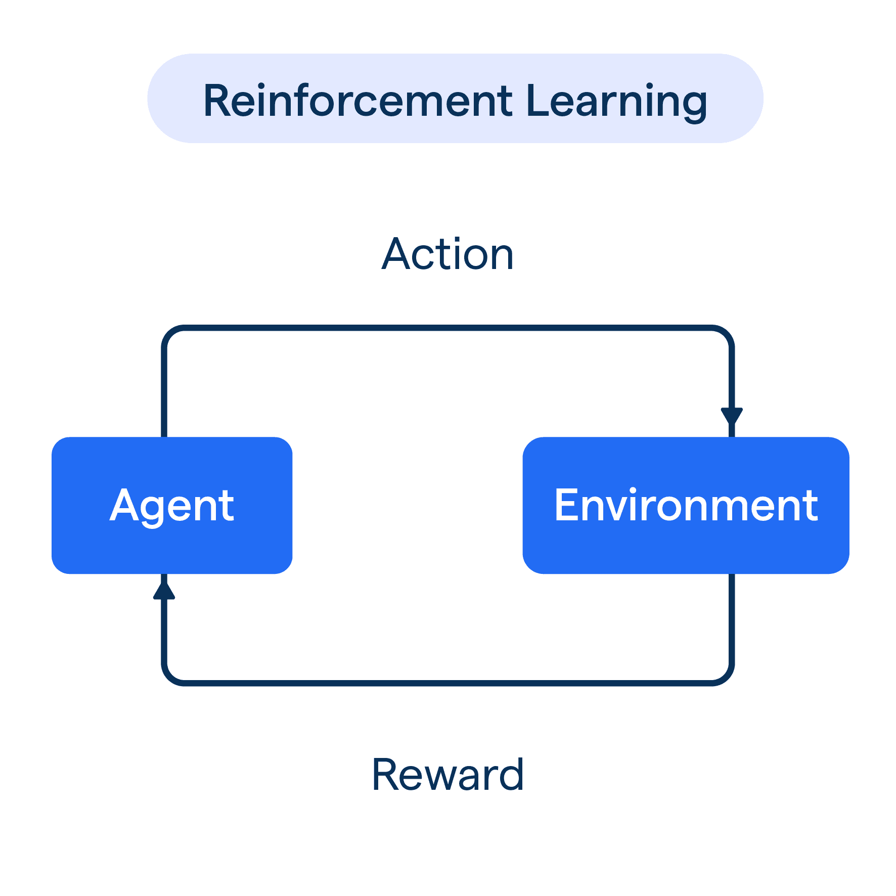

# مقدمة
راجعنا في مقالة سابقة تعلم الآلة وكانت بمثابة الطريقة الأساسية للذكاء الاصطناعي , حيث يتم تلقين الحاسوب بيانات مجهزة ومحللة ومنظفة مسبقاً عبر خوارزميات وأسس معينة , ويمكن من هنا مراجعة المقالة :

[مقدمة في تعلم الآلة](https://saadaiblog.netlify.app/blog/post7)

بينما يتم إستخدام خوارزميات التجميع والتصنيف والإنحدار في تعلم الآلة , وكذلك توجد طرق متقدمة أكثر في تعلم الآلة مثل الشبكات العصبية الاصطناعية أو :

`Artificial Neural Networks`

وستكون المقالة هذه مقدمة لمقالة التعلم العميق لاحقاً .

## أنواع تعلم الآلة المتقدم

 

### تعلم آلة مُشرف عليه
وهو نوع من أنواع تعلم الآلة يعتمد بشكل أساسي على دالة رياضية حيث يتم اعطاء النموذج كلاً من :
- المدخلات أو الخصائص

`Features`

- المُخرجات

`Labels`

حيث يقوم النموذج بتوقع النتيجة بناء على المدخلات والمخرجات التي تم تدريبه عليها , وتربط الدالة الرياضية بين المدخلات والمخرجات

مثال : نموذج توقع هل البريد الإلكتروني ضار أم لا بناء على مدخلات ومخرجات معينة

وقد يتم إستخدام شبكة عصبية فيها ذات أوزان

تعد خوارزميات التصنيف والإنحدار من خوارزميات تعلم الآلة الخاضع للإشراف .

### تعلم آلة غير خاضع لإشراف

 في تعلم الآلة غير الخاضع للإشراف , لانملك في التعلم نتائج سابقة وغرض التعلم نفسه هو إيجاد الهدف والبنية المخفية في البيانات من دون إعطاء قيم افتراضية موضحة مسبقاً .

يعد التجميع من أبرز خوارزميات تعلم الآلة غير الخاضعة للإشراف

### تعلم آلة مُعزز

تعلم الآلة التعزيزي هو طريقة ثالثة , حيث تكون هناك بيئة جاهزة يتعلم فيها النموذج من أخطائه وبعدد محاولات , مع كل محاولة صائبة أم خاطئة تجيب البيئة بنظام مكافآت وعقوبات مع تغيير نظام سياسة المكافآت لتعظيم المكافآة على المدى الطويل .

## مصادر ومراجع :
- [Coursera - IBM Machine learning with python](https://www.coursera.org/learn/machine-learning-with-python)
- [Wikipedia - Machine learning](https://en.wikipedia.org/wiki/Machine_learning)
- [IBM - Machine Learning vs Deep Learning vs Neural Networks](https://www.ibm.com/qa-ar/think/topics/ai-vs-machine-learning-vs-deep-learning-vs-neural-networks)
- [Amazon Web Services - What is Neural Network ?](https://aws.amazon.com/what-is/neural-network/)
- Deep Learning Book - For Dummies
