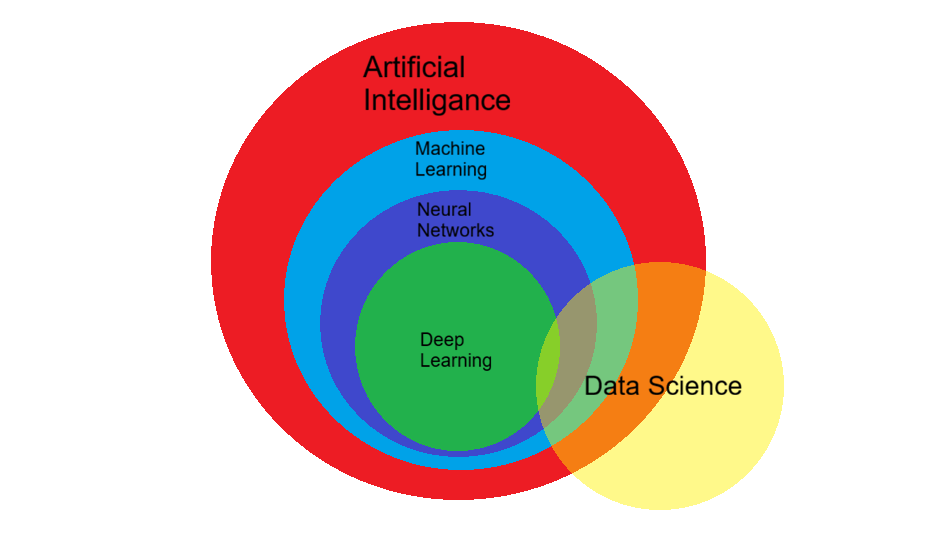
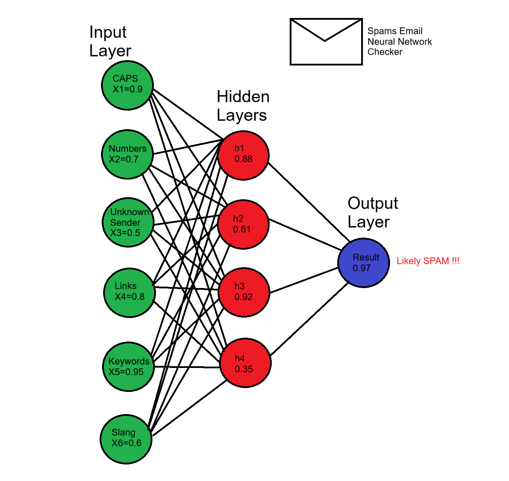

التعلم العميق هو فرع من تعلم الآلة حيث يتعمق النموذج في طبقات التعلم في الشبكة العصبية , وغالباً ما يستخدم التعلم العميق تقنية الشبكات العصبية .

## تعلم الآلة ضد التعلم العميق
يعتبر تعلم الآلة المفهوم الشامل والطريقة الأساسية تقريباً لتعليم النموذج بيانات مُنظفة ومحللة ومجهزة مسبقاً عبر خوارزميات وطرق معينة .

بينما التعلم العميق يستخدم الشبكات العصبية في التعلم بشكل أساسي , ويعد التعلم العميق الطريقة الأساسية حالياً لتدريب نماذج الذكاء الاصطناعي في العقد الثالث من القرن الواحد والعشرون .

نشطت نماذج التعلم العميق مؤخراً مع النماذج اللغوية الكبيرة ولها إستخدامات واسعة في مجالات كالطب والسيارات وعلم الفضاء وحتى في مجال الكتابة

تعد التفرعات الرئيسية والمجالات المتأثرة بالتعلم العميق في عصرنا الحالي كثيرة أشهرها :

- معالجة اللغة الطبيعية :
أو ال :
`NLP - Natural Language Processing`

حيث تعالج النماذج بيانات ومستندات نصية قام الإنسان بانشائها وتحاول فهمها وإستخدامها في مجالات متقدمة كروبوتات المحادثة وتحليل ذكاء الأعمال وتصنيف المشاعر البشرية كالحزن والسعادة والفرح وغيرها...

- الرؤية الحاسوبية :
حيث يتم إستخدام خوارزميات التعلم العميق في فهم الصور ومحاولة إستنتاج النتائج المطلوبة منها كأجهزة رصد السرعة المخالفة أو إزالة الصور ومقاطع الفيديو غير المناسبة للعرض في وسائل التواصل الإجتماعي

لرؤية المشروع كاملاً على قيتهب :

[المشروع](https://github.com/Saad711T/CarsAI)

وغيرها من الإستخدامات , ويعد التعلم العميق في عصرنا هذا من التقنيات التي لا يمكن الإستغناء عنها بسهولة نظراً إلى ما أوصلته لنا من إمكانيات لمجال الذكاء الاصطناعي وتطبيقاته .

## مصادر ومراجع :

- [IBM - Machine Learning vs Deep Learning vs Neural Networks](https://www.ibm.com/qa-ar/think/topics/ai-vs-machine-learning-vs-deep-learning-vs-neural-networks)
- [Amazon Web Services - What is Neural Network ?](https://aws.amazon.com/what-is/neural-network/)
- Deep Learning Book - For Dummies
- Data Science Programming Book - For Dummies