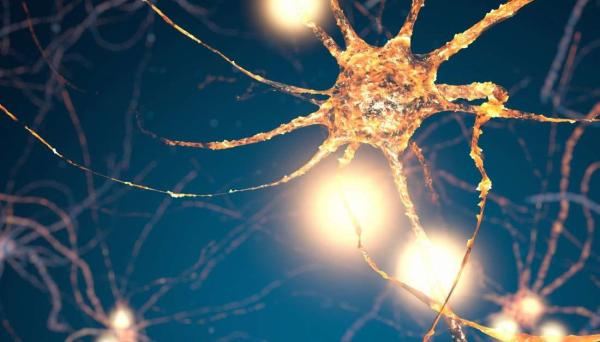

الشبكة العصبية هي تقنية في عالم الذكاء الاصطناعي تحاكي نظام الخلايا العصبية في جسم الانسان , تستخدم في تعلم الآلة وبشكل أخص التعلم العميق وتعد متعددة الإمتيازات والإستخدامات .

[شاهد مقالة تحليل الشبكات في عالم بحوث العمليات كمقدمة للموضوع](https://saadaiblog.netlify.app/blog/post12)

### لماذا نستخدمها ؟

يتم إستخدام الشبكات العصبية لأنها تقنية حديثة تتمكن من حل المشكلات المعقدة وتتوقع نتائج البيانات وتقوم بتمييز الأنماط غير الخطية كونها ذات إمتيازات لا تقدر عليها البرمجة الإعتيادية والخوارزميات التقليدية .

تتكون الشبكة العصبية من طبقة إدخال حيث فيها مدخلات النموذج وطبقة إخراج حيث فيها النتيجة المُفترضة , مع طبقة مخفية تسمى طبقات المعالجة وغالباً ماتكون عميقة فيُسمى هذا النوع من التعلم بالـ :

`Deep Learning - التعلم العميق`

ومن هنا يمكنك رؤية المقالة عن التعلم العميق :

[مقدمة في التعلم العميق](https://saadaiblog.netlify.app/blog/post32)

### أنواع الشبكات العصبية

- الشبكات العصبية الالتفافية (CNNS - Convolutional neural networks) :

وهي مصممة بشكل رئيسي للتعامل مع البيانات الشبكية كالصور وتطبيقاتها مثل الرؤية الحاسوبية وتحليل أنماط الوجوه

- الشبكات العصبية التكرارية (RNNS - Recurrent neural networks) :

تتضمن حلقات من الاسترجاع الذاكري تسمح باستمرارية معلومات الشبكة العصبية وتستخدم في نماذج الحوارات والأحاديث

- المحولات (Transformers) :

تقنية حديثة شبيهة بالشبكات العصبية التكرارية , تستخدم في معالجة اللغة الطبيعية ويتم إستخدامها في نماذج لغوية كبيرة مثل شات جي بي تي وجيمناي .

### أهميتها

تعد الشبكات العصبية من التقنيات التي أصبح من الصعب الإستغناء عنها في عصرنا الحالي , كونه يعتمد عليها بشكل كبير التعلم العميق والذي طور مجال الذكاء الاصطناعي وقام بنقله نقلة نوعية وساهم في مجالات الرؤية الحاسوبية وكشف الأنماط ومعالجة الصور والتي تستخدم في مجالات أمنية وثقافية وعلمية وحتى الترفيهية كألعاب الفيديو .

#### أبرز المكتبات التي يمكن إستخدام فيها الشبكات العصبية

- Scikit learn

من أشهر مكتبات تعلم الآلة مفتوحة المصدر , والتي تم استعراضها لأول مرة في معرض جوجل الصيفي للبرمجة عام 2007 م . وتطورت كثيراً منذ ذلك الحين حتى أصبحت تدعم كذلك الشبكات العصبية.

**تأكد من تثبيت لغة بايثون في جهازك مسبقاً**
تحميل المكتبة في طرفية جهازك :

 

`pip install sklearn`

- TensorFlow

مكتبة تم تطويرها من قبل جوجل , وهي من أشهر المكتبات الخاصة بتعلم الآلة المتقدم وجزئياً التعلم العميق والشبكات العصبية. وهي تدعم عدة لغات مثل بايثون وسي بلس بلس.

تحميل المكتبة في طرفية جهازك :

 

`pip install tensorflow`

- Keras

كيراس هي مكتبة مخصصة للشبكات العصبية مفتوحة المصدر تم تطويرها بلغة بايثون , ويمكن أن تعمل بالتوازي مع مكتبة تينسور فلو بل وتدعم بيئات أخرى مثل لغة آر

تحميل المكتبة في طرفية جهازك :

 

`pip install keras tensorflow`

- PyTorch

مكتبة بايثون مفتوحة المصدر تم تطويرها من قبل الباحثين في فيسبوك/ميتا عام 2016 . المكتبة تعد المنافس الرسمي لتينسور فلو ومتخصصة في تعلم الآلة المتقدم والتعلم العميق.

تحميل المكتبة في طرفية جهازك :

 

`pip install torch torchvision torchaudio`

## مصادر ومراجع :
- [Amazon Web Services - What is Neural Network ?](https://aws.amazon.com/what-is/neural-network/)
- Deep Learning Book - For Dummies
- Data Science Programming Book - For Dummies
- [IBM - What is Neural networks ?](https://www.ibm.com/think/topics/neural-networks)
- [Google Developers - Neural Networks](https://developers.google.com/machine-learning/crash-course/neural-networks)

