الشبكة الحاسوبية هي عدد من الأجهزة مربوطة في بعضها البعض .

[راجع مقالة تحليل الشبكات في مجال بحوث العمليات](https://saadaiblog.netlify.app/blog/post12)

### لماذا نستخدم الشبكات ؟

- للتواصل بين أكثر من جهاز

- لمشاركات الملفات بسهولة وأريحية

- زيادة الانتاجية والسرعة في التواصل والأداء

- تقليل التكاليف

ومع ذلك فقد أتت ثغرات أمنية جديدة وصعبة في مجال شبكات الحاسب , فلهذا تعد شبكات الحاسب بذرة الأمن السيبراني ومن المجالات المهمة جداً لمحللي وخبراء الأمن السيبراني وحتى لبعض خبراء حوكمة البيانات والذكاء الاصطناعي .

### أنواع الشبكات

#### بناء على حجم الشبكة

- شبكة محلية (LAN - Local Area Network) :

وهي شبكة ذات نطاق محلي كالغرفة والمنزل وقسم إداري معين , وهي ذات وصول محدود بين عدد من الأجهزة .

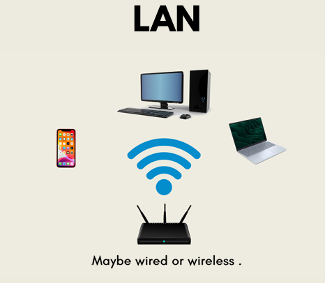

وقد يكون الإتصال سلكياً أو لاسلكياً

- شبكة موسعة (WAN - Wide Area Network) :

وهي ربط شبكي من شبكتين محليتين أو أكثر , ويعتبر الإنترنت مثالاً على الشبكة الموسعة والإنترنت هي شبكة الشبكات وتعد أكبر شبكة حاسب موجودة في عصرنا الحالي .

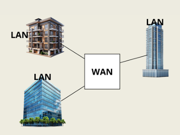

- شبكة ربط بين المدن (MAN - Metropolitan Area Network)

#### بناء على طريقة الإتصال

- إتصال لإتصال (P2P - Peer to Peer) :

بسيطة وسهلة التنفيذ لكن تعاني من سوء أمني وكذلك صعبة التنفيذ , وقد تكون بين جهازين فأكثر

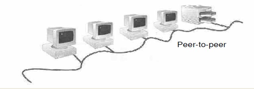

- الخادم والمستخدم (Client and Server) :

حيث يطلب أكثر من مستخدم خدمة من الخادم عبر شبكة موسعة فيرد بالإستجابة والرد , وهذه هي الطريقة الأبرز والمستخدمة في تطبيقات الويب الكبيرة اليوم .

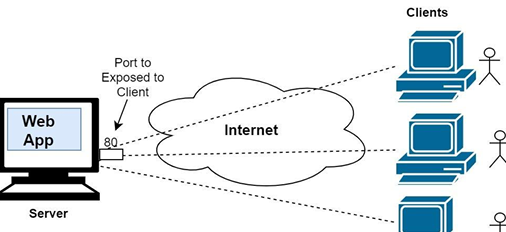

#### بناء على هيكل الشبكة

على عدة أشكال

- باص

- حلقية

- نجمة

- مكعب

والمزيد...

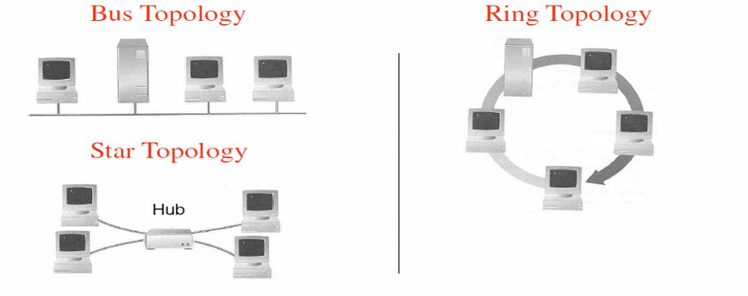

### نماذج الطبقات

تستخدم الشبكات نماذج طبقات مثل :

- OSI Model (Open Systems Interconnected Model) :

نموذج قام بإصداره منظمة الآيزو عام 1970 يتكون من سبعة طبقات تبدأ من طبقة التطبيق ثم العرض ثم الجلسات ثم التحويل ثم الشبكة ثم طبقة ربط البيانات ثم الطبقة الفيزيائية .

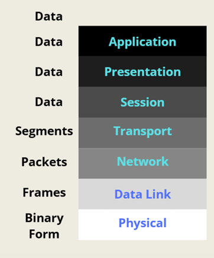

 

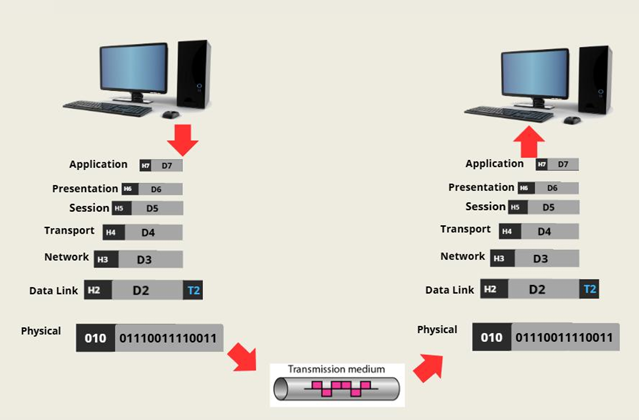

في نموذج الأو إس آي البيانات من عند المرسل تذهب تنازلياً وتصعد تصاعدياً عبر الطبقات إلى المُستقبل .

وفي كل طبقة يضاف ترويسة لكن في طبقة نقل البيانات يتم إضافة تذييل كذلك ليتم تشفيرها في الطرف المقابل , وفي كل طبقة يتم فك تغليف ماتم تغليفه في نفس الطبقة من جهة المُرسل .

- TCP/IP :

نموذج يلخص نموذج الأو إس آي ويجعل طبقات الشبكة من سبعة إلى أربعة فقط مكونة من خمسة مكونات فقط .

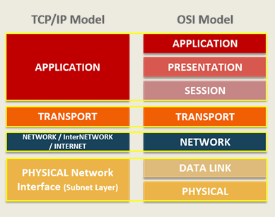

وهي طبقة تعتمد بشكل كبير على بروتوكولات الشبكة الرابعة والثالثة :

`TCP - Transfer Control Protocol`

وهو البروتوكول الرئيسي في الطبقة الرابعة

بينما :

`IP - Internet Protocol`

هو البروتوكول الرئيسي في الطبقة الثالثة للدخول في طبقة الشبكة .

### أبرز البروتوكولات

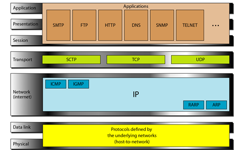

- `HTTP - Hypertext Transfer Protocol` :

وهو بروتوكول في طبقة التطبيقات لنقل بيانات نصية في عالم الويب , ويحمل المنفذ 80

- `SMTP - Simple Mail Transfer Protocol` :

هو بروتوكول في الطبقة السابعة لإستخدامات البريد الإلكتروني ويحمل المنفذ 25

- `DNS - Domain Name System` :

هو بروتوكول في الطبقة السابعة يحول عناوين المواقع لعناوين آي بي للوصول للهدف المحدد ويحمل المنفذ 53

- `TCP`

- `IP`

تم إيضاحها سابقاً

#### IP - MAC

الآي بي هو عنوان الجهاز في الشبكة وقد يكون عاماً أو خاصاً , وهناك نوعين رئيسيان وهما :

- IPv4 :

يستخدم نظام عنونة مكوّناً من 32 بت، مما يتيح توفير حوالي 4.3 مليار عنوان فريد

والعنوان يكون بهذا الشكل :

``192.168.1.1``

مع تواجد نقطتان رئيسيتين بيمين العنوان ورقم المنفذ المستخدم للعنوان , وهي مازالت تستخدم لهذه اللحظة لكن مع كثرة البشر والحواسيب المستخدمة أضطررنا إلى نظام جديد وهو :

- IPv6 :

يستخدم عناوين بطول 128 بت بدلاً من 32 بت , يعني يكفي لتخصيص عنوان لكل ذرة موجودة على سطح كوكب الأرض وهو يعتبر تطوراً مذهلاً .

أما الماك أو :

**MAC - Media Access Control**

فهو عنوان فريد من نوعه لا يتغير , تضعه الشركة المصنعة للجهاز على ختم كرت الشبكة الخاص به ويبقى ثابتاً .

يتكون عادةً من 12 رمز مقسمة ل 6 أزواج وتتكون من نظام فوق عشري وتكون بهذا الشكل :

``00:1A:2B:3C:4D:5E``

الآي بي يتغير حسب الموقع والظروف بينما الماك لا يتغير بتات البتة .

### أجهزة الشبكات

لكل طبقة هناك جهاز رئيسي مسؤول عن التواصل في الطبقة

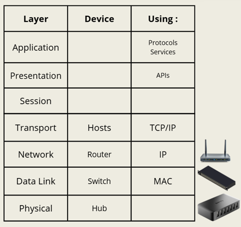

فمثلاً يعد المُحول أو الراوتر هو الجهاز الرئيسي في الطبقة الثالثة وكذلك السويتش في الطبقة الثانية .

بإفتراض أنه لدينا شبكة محلية مربوطة بسويتش بين أربعة أشخاص

فإن السويتش سيتعامل مع عنوان الماك لكل جهاز ويحول الرسالة من الجهاز المُرسل للمُستقبل دون غيره .

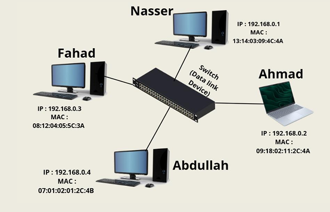

 

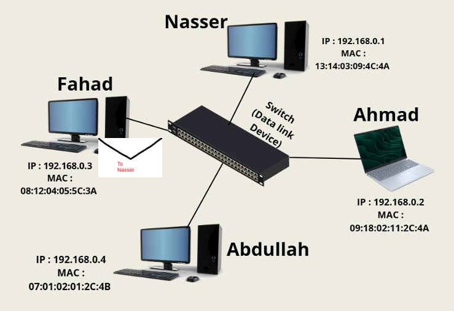

 

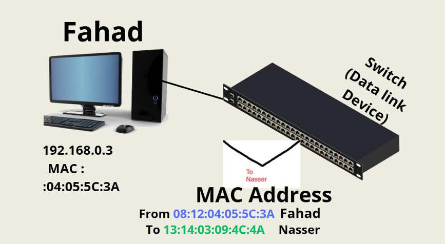

 

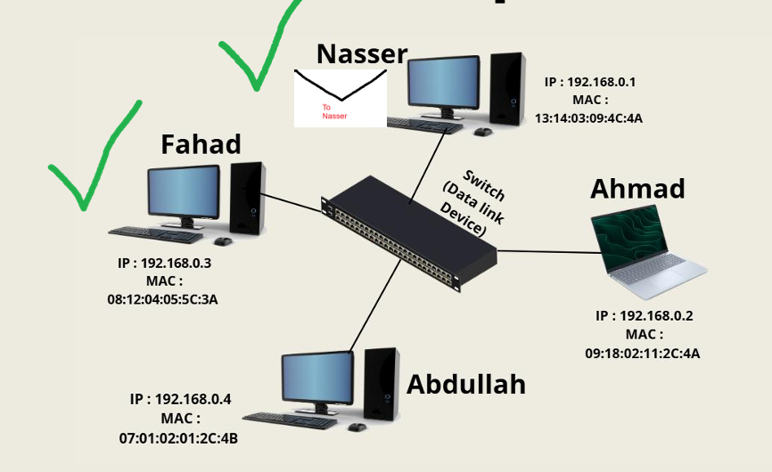

ماذا عن الإرسال من شبكة محلية لأخرى ؟ يتم ذلك عبر الإنترنت مثلاً , فلو أفترضنا أن نفس الشبكة المحلية هذه ويريدون الإرسال من منزلهم في المملكة العربية السعودية إلى أخيهم المبتعث في الولايات المتحدة الأمريكية فإنها ستمر عبر سويتش شبكتهم ثم تذهب إلى عدد من الراوترات المرتبطة ببعضها حتى تصل للراوتر المؤدي لسويتش شبكة أخيهم فتصل له الرسالة

لكن الراوترات لا تحول الرسائل إلا بعناوين الآي بي على عكس جهاز السويتش .

والأمر مشابه بشكل كبير في الشبكات اللاسلكية و لايختلف إلا في كونه أن هناك إضافي يسمى :

`WAP - Wireless Access Point`

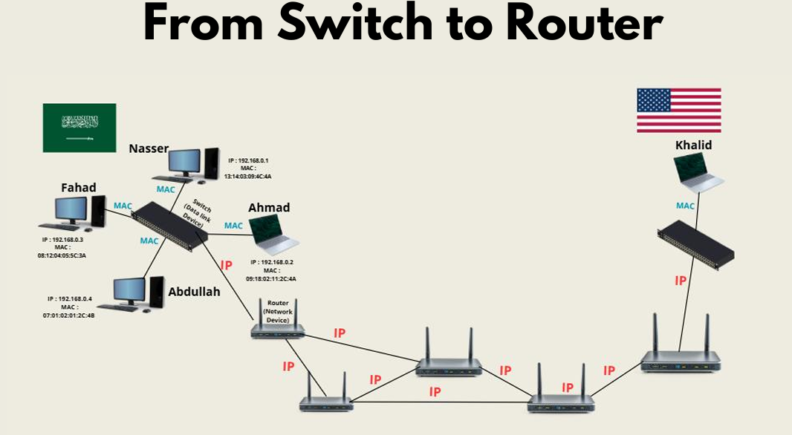

مثال على شبكة شركة صغيرة سلكية ولاسلكية :

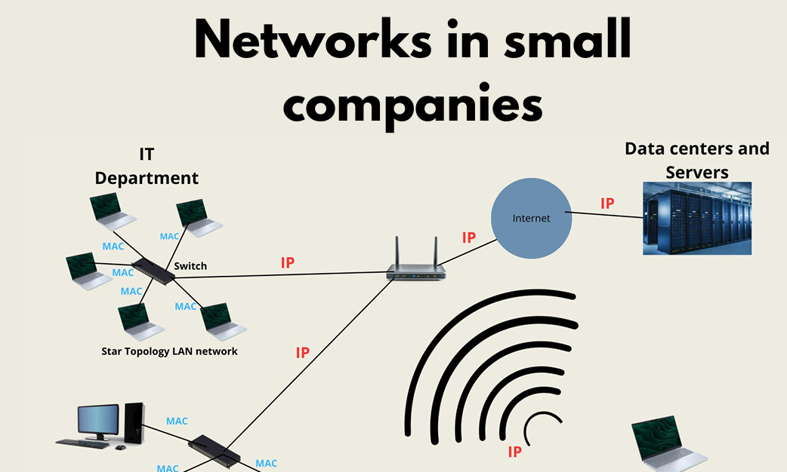

ويعد مجال شبكات الحاسب أساسياً لمجال مستودعات البيانات التي تساهم بشكل كبير في نمو وتطور الذكاء الاصطناعي .

## مصادر ومراجع

- [NetworkChuck - CCNA prepare](https://www.youtube.com/playlist?list=PLIhvC56v63IJVXv0GJcl9vO5Z6znCVb1P)
- [IBM - What is Computer Networking ?](https://www.ibm.com/think/topics/networking)
- [Cisco - Introduction to Networks](https://www.netacad.com/courses/ccna-introduction-networks?courseLang=en-US)
- Networks - for Dummies Book

