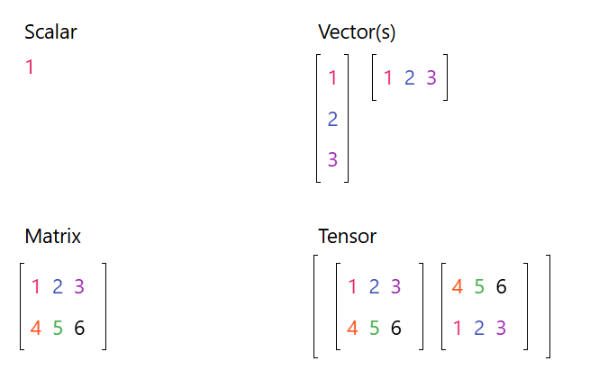

مكتبة باي تورش هي مكتبة تعلم آلة وتعلم عميق مفتوحة المصدر تم انشائها من قبل شركة ميتا للغة بايثون كوريثة لمكتبة تورش في لغة سي بلس بلس , وحالياً يتم تقديم الدعم لها من قبل مؤسسة لينكس .

في عامنا الحالي تعد باي تورش منافساً قوياً لتينسورفلو وكيراس في مجال التعلم العميق , خصوصاً دعم باي تورش لنسخ بايثون الحديثة على عكس مكتبة تينسورفلو .


يتم إستخدام المكتبة من قبل عدة جهات مثل :

- OpenAI (ChatGPT)

- HuggingFace

- Meta

- Google

- Uber (Pyro)

### تحميل المكتبة
وجب التأكد من تثبيتك للغة بايثون مسبقاً , ثم كتابة الأمر التالي في طرفية جهازك :

<br>

`pip install torch torchvision torchaudio`

<br>

والتأكد من أن نسخة لغة بايثون على جهازك تدعم المكتبة مثل نسخ 3.13 أو ماقبل .

### مثال للوظائف الأساسية

##### Tensors - الموتر

يجب مراجعة كلاً من :
- [الجبر الخطي](https://saadaiblog.netlify.app/blog/post13)
- [مكتبة نمباي](https://github.com/Saad711T/Matrices-Arrays-Programming-minibook)

للبدء والحديث عن الموترات في المكتبة




```{python}
import torch
dtype = torch.float
device = torch.device("cpu")  # Execute all calculations on the CPU
# device = torch.device("cuda:0")  # Executes all calculations on the GPU

# Create a tensor and fill it with random numbers
a = torch.randn(2, 3, device=device, dtype=dtype)
print(a)
# Output: tensor([[-1.1884,  0.8498, -1.7129],
#                  [-0.8816,  0.1944,  0.5847]])

b = torch.randn(2, 3, device=device, dtype=dtype)
print(b)
# Output: tensor([[ 0.7178, -0.8453, -1.3403],
#                  [ 1.3262,  1.1512, -1.7070]])

print(a * b)
# Output: tensor([[-0.8530, -0.7183,  2.58],
#                  [-1.1692,  0.2238, -0.9981]])

print(a.sum()) 
# Output: tensor(-2.1540)

print(a[1, 2])  # Output of the element in the third column of the second row (zero-based)
# Output: tensor(0.5847)

print(a.max())
# Output: tensor(0.8498)
```
#### الشرح

<hr>

``import torch``
وهذا هو أمر استدعاء المكتبة في الكود

<hr>


``dtype = torch.float``
هنا عرفنا نوع البيانات على أنها من نوع :

**float**

وهي أرقام عشرية تتكون من 32 بت , شبيهة بالنوع :

**double**

<hr>

``device = torch.device("cpu")``

هنا عرفنا متغير خاص بالجهاز الذي سيتم التدريب عليه , وجعلنا المعالج هو من يقوم بالتدريب

ملاحظة : المعالج هو العقل المشغل للكمبيوتر وغالباً لا يُستخدم في التدريب لأنه يكون بطيء ويتحمل عبئ تشغيل نظام التشغيل والبرامج وكل شيء بما في ذلك تدريب النموذج , فقد يتأخر لساعات وقد لا ينجح أساساً

فلذلك نحن نستخدم كرت الشاشة أو وحدة المعالجة الرسومية المعروفة بالـ :

`GPU`

لأنه يمتلك العديد من الأنوية الصغيرة مقارنة بالمعالج , ولديه مهام أقل ولايحمل عبئ جهاز الحاسوب بأكمله فلذلك نرى لاعبي ألعاب الفيديو ومطوري الذكاء الاصطناعي مهتمين بكرت الشاشة أكثر من المعالج مع أنه كليهما مهم .

<hr>


``a = torch.randn(2, 3, device=device, dtype=dtype)``

هنا قمنا بإنشاء مصفوفة مكونة من صفين وثلاثة أعمدة ذات أرقام عشوائية , وتستند على الجهاز المعرف مسبقاً وهو المعالج ونوعها رقم عشري أو فلوت عرفناه مسبقاً

<hr>

``b = torch.randn(2, 3, device=device, dtype=dtype)``

مصفوفة أخرى نفس تفاصيل المصفوفة السابقة وأيضاً تحمل أرقاماً عشوائية

<hr>

``print(a * b) #ضرب المصفوفتين الأولى والثانية``

``print(a.sum()) #جمع كل عناصر المصفوفة``

``print(a[1, 2]) # العنصر في المصفوفة الأولى الموجود في الصف الأول - العمود الثاني``

``print(a.max()) # أعلى قيمة عنصر في المصفوفة الأولى``


## مصادر ومراجع :
- [PyTorch Documentation](https://docs.pytorch.org/tutorials/beginner/basics/intro.html)
- [W3Schools - AI Tensors](https://www.w3schools.com/ai/ai_tensors.asp)
- [Wikipedia - PyTorch](https://en.wikipedia.org/wiki/PyTorch)
- Deep Learning Book - For Dummies
- [Nvidia - What is PyTorch ?](https://www.nvidia.com/en-us/glossary/pytorch/)
