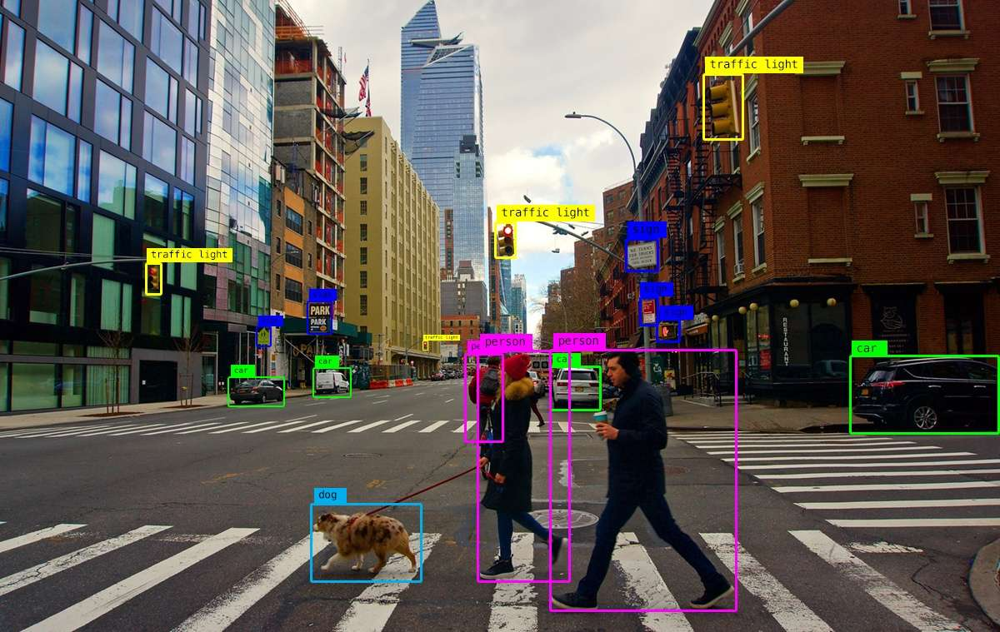

الرؤية الحاسوبية هي فرع من الذكاء الاصطناعي يجعل الآلات قادرة على رؤية الصور واستخراج بيانات دقيقة منها للتحليل والتصنيف .

[هذا رابط المشروع](https://github.com/Saad711T/CarsAI)

### تطبيقات الرؤية الحاسوبية

يمكن إنشاء تطبيقات رؤية حاسوبية بإستخدام الشبكات العصبية ونماذج التعلم العميق , وتعد من التطبيقات المتقدمة للذكاء الاصطناعي في عصرنا الحالي والتي تستخدم في عدد من التطبيقات والأمثلة في حياتنا الواقعية وأبرزها :

- تطبيق تحليلات طبية

- تطبيق يتعرف على غرض يتحرك في إطار الصورة

- تطبيق رصد السرعة المخالفة على الطريق السريع

- تطبيق تحليل الأبعاد من خلال صورة أو سلسلة من الصور

كما أنه تستخدم النماذج اللغوية الكبيرة الرؤية الحاسوبية في التعرف على صور ومرفقات المستخدم التي قام بإرفاقها له , بالإضافة لتطبيقات وخدمات السلامة والتشغيل مثل السيارات ذاتية القيادة وكاميرات المراقبة المتقدمة .

### الرؤية الحاسوبية ضد معالجة الصور
يختلف مجال الرؤية الحاسوبية عن مجال معالجة الصور في الهدف الأساسي ، فمعالجة الصور تأخذ صورة كمدخل وتخرج صورة أخرى معدلة (تحسين جودة , فلاتر , إزالة الضوضاء) , بينما الرؤية الحاسوبية تأخذ صورة أو فيديو وتخرج فهماً ومعلومات منها كتصنيف الأشياء والتعرف عليها وتتبعها .
### الرؤية الحاسوبية والشبكات العصبية

كما ذكرنا من قبل فأنه من الممكن بل من المستحسن بناء تطبيقات رؤية بالحاسب مبنية على تقنيات الشبكات العصبية والتعلم العميق , وأغلب أنظمة الرؤية الحاسوبية في العقد الحالي تعتمد على الشبكات العصبية بشكل رئيسي

يمكنك من هنا مراجعة الآتي وهي مقالات سابقة في المدونة :

[التعلم العميق](https://saadaiblog.netlify.app/blog/post32)

 

[الشبكات العصبية](https://saadaiblog.netlify.app/blog/post33)

## مصادر ومراجع :
- [ويكيبيديا - رؤية حاسوبية](https://ar.wikipedia.org/wiki/%D8%B1%D8%A4%D9%8A%D8%A9_%D8%AD%D8%A7%D8%B3%D9%88%D8%A8%D9%8A%D8%A9)
- [AWS - ماهي رؤية الكمبيوتر ؟](https://aws.amazon.com/ar/what-is/computer-vision/)
- [IBM - What is Computer Vision ?](https://www.ibm.com/think/topics/computer-vision)