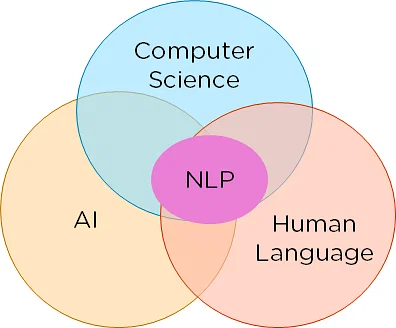

معالجة اللغة الطبيعية هو فرع من فروع الذكاء الاصطناعي يهتم بدمج تقنيات الذكاء الاصطناعي الحديثة مع مجال اللغويات .

معالجة اللغة الطبيعية أو :

`NLP - Natural Language Processing`

تمكن تقنية معالجة اللغة الطبيعية النماذج من فهم اللغة البشرية وتحليلها والتفاعل معها , تلعب معالجة اللغة الطبيعية دوراً قوياً في النماذج اللغوية الكبيرة وتمكنها من فهم الأوامر الصوتية والرد عليها .

تبدأ عملية تنفيذ معالجة اللغات الطبيعية بجمع وإعداد بيانات نصية أو كلامية غير مهيكلة من مصادر مثل مستودعات البيانات السحابية أو الاستبيانات أو رسائل البريد الإلكتروني أو مصادر البيانات المختلفة .

[راجع من هنا مستودعات البيانات](post26.6.qmd)

### تطبيقات معالجة اللغة الطبيعية

تستُخدم معالجة اللغة الطبيعية في النماذج اللغوية الكبيرة وأوامرها الصوتية مثل :

- ChatGPT

- Gemini

وكذلك تسٌتخدم في الأوامر الصوتية في البحث بمواقع وسائل التواصل الاجتماعي , وأيضاً في المساعدات الصوتية الشهيرة مثل :

- Siri :

مساعد صوتي ذكي طورته شركة آبل في نظام آي أو إس , يستخدم معالجة اللغة الطبيعية في الرد على المستخدم ويعتبر من أشهر تطبيقات معالجة اللغة الطبيعية منذ 2019 م .

- Alexa :

كانت أمازون أليكسا خدمة تصنيف مواقع الكترونية لكنه حالياً يقتصر على خدمات مساعد صوتي ومنفذ ذكي للأوامر , يمكن تركيبه ووصله بالمنزل الذكي وتأدية المهام الواجبة المطلوبة منه .

- Bixby

نموذج قامت شركة سامسونغ بتطويره لأجهزة هواتف سامسونغ جالاكسي ويعتبر المساعد الرقمي المدمج بهواتف سامسونغ جالاكسي .

## مصادر ومراجع

- [AWS - ما المقصود بمعالجة اللغة الطبيعية ؟](https://aws.amazon.com/ar/what-is/nlp/)
- [Oracle - What is NLP ?](https://www.oracle.com/artificial-intelligence/natural-language-processing/)
- [IBM - Natural Language Processing](https://www.ibm.com/think/topics/natural-language-processing)