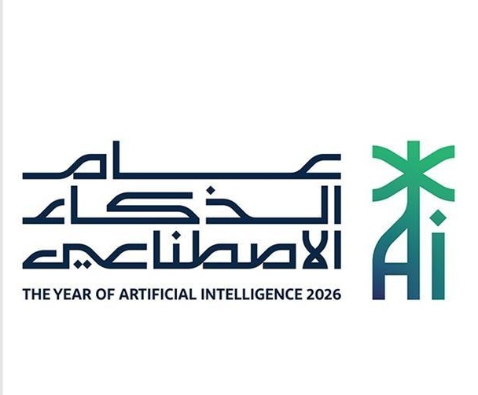

أهلاً بك في مدونتي الخاصة بعالم الذكاء الاصطناعي وتعلم الآلة , هناك العديد من المقالات حول المجال هذا بالإضافة لمجالات أضافية أخرى مثل الرياضيات , أساسيات البرمجة وحتى المقالات النظرية المتمحورة حول مجال الذكاء الاصطناعي

### الذكاء الاصطناعي ليس فقط شات جي بي تي
الذكاء الاصطناعي مفهوم واسع وأشمل حتى من بوتات المحادثة والنماذج اللغوية الكبيرة , ويعد مجالاً قديماً ومتجذراً في علوم الحاسب بل ومرتبط بعلوم أخرى كالرياضيات بشقيها الرئيسيان التطبيقية والبحتة وحتى الفلسفة والأدب !

أنظمة معالجة الصور , الرؤية الحاسوبية وتطبيقاتها كجهاز مخالفة السرعة , أنظمة توصيات مقاطع الفيديو وصولاً إلى بوتات المحادثة والدعم الفني كلها ذكاء اصطناعي !

#### لرؤية أحدث التدوينات
[Link](blog.qmd)

## من أنا ؟
- [0xSaad](https://github.com/Saad711T)

سعد المالكي , عالم بيانات ومهندس برمجيات سعودي وطالب علوم حاسب مهتم في تطوير المشاريع مفتوحة المصدر لاسيما في مجال تطوير الويب وعلم البيانات.

أبرز أعمالي :

-[SaadBrowser](https://github.com/Saad711T/SaadBrowser) : متصفح شخصي من مطور واحد يعمل على ويندوز ولينكس وآندرويد

-[Vectorizer-SVG](https://pypi.org/project/vectorizer-svg) : مكتبة في لغة بايثون خاصة بالجبر الخطي وخصوصاً المتجهات والعمليات المتعلقة بها كإشتقاق المتجه وضرب المتجهات وحتى رسم المتجهات

-[Matrices&Arrays Programming minibook](https://github.com/Saad711T/Matrices-Arrays-Programming-minibook) : كتاب برمجة المصفوفات هو كتاب تم كتابته بواسطة جوبيتر نوتبوك يشرح ويلخص طريقة عمل مكتبة نمباي الرياضية في لغة بايثون لصنع المصفوفات المستخدمة في الذكاء الاصطناعي والحوسبة العلمية

-[CarsAI](https://github.com/Saad711T/CarsAI) : نموذج شبكة عصبية مبني بمكتبة باي تورش يقوم بأعمال متعلقة بالرؤية الحاسوبية ومعالجة الصور لتصنيف شركات السيارات من الصور وتم تدريبه على خمسة شركات سيارات شهيرة

#### للتواصل - For Contact

  
    
  
  

 

 All rights Reserved 2026

